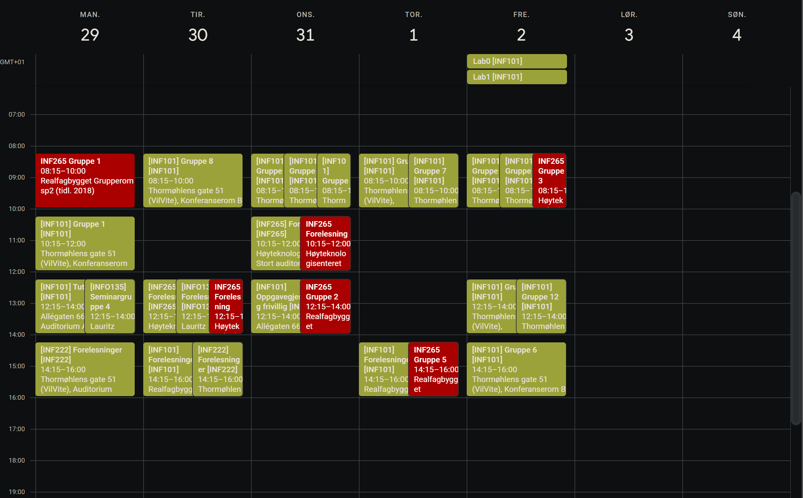
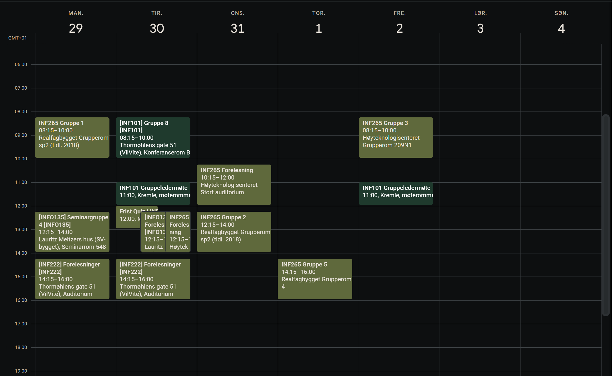

# Google Kalender Synkroniseringsverktøy

## Beskrivelse
Dette prosjektet inneholder et sett med Google Apps Script-funksjoner designet for å synkronisere hendelser fra en kildekalender til flere målkalendere innenfor Google Kalender. Det gir muligheten til å filtrere og velge spesifikke hendelser basert på deres titler, datoer, og ukenummer, samt tilbyr funksjonalitet for automatisk sletting av hendelser for å unngå duplikater. Dette prosjektet inneholder to hovedskript: `filtrerKalenderKopi.js` og `sletteKalenderKopi.js`, som sammen sørger for en måte abbonnere på andre kalendere og filtrer ut kun ønskete hendelser. Prosjektet inneholder også et kopierings-skript: `syncFiler.py` som kan brukes for å raskt og effektiv synkronisere de faktiske skripetene uten å kopiere og dele de faktiske id-ene til kalenderne dine. I tilegg innholder det et pre-commit-skript `pre-commit` som kan brukes for å lage en pre-commit-hook, som kjører både kopieringsskripet og pusher til Google Apps Script området/nettsiden for å automatisere prosessen.

## Før

## Etter

## Funksjoner

- **Hendelsesfiltrering:** Velg og kopier hendelser basert på titler, ukedager, og ukenummer.
- **Automatisk sletting:** Fjern eksisterende hendelser i målkalendere før synkronisering.
- **Flere kalendere:** Støtte for synkronisering med flere målkalendere basert på ulike kriterier.

## Installasjon

Kopier skriptet inn i Google Apps Script-omgivelsen knyttet til din Google Kalender.

## Bruk

Oppdater kalender-IDene i `copyFilteredEvents`-funksjonen med de relevante kalenderne du ønsker å synkronisere mellom. Kjør deretter funksjonen for å starte synkroniseringen.

## Automatisering av Script Kjøringer

For å maksimere effektiviteten av disse skriptene, kan du sette opp automatiserte kjøringer via Google Apps Script's Trigger-funksjonalitet. Dette lar deg planlegge skriptene til å kjøre på spesifikke tidspunkter eller intervaller (for eksempel daglig eller ukentlig), noe som sikrer at kalenderdataene dine kontinuerlig blir oppdatert uten manuell inngripen.

## Kjerneskripter

- `copyFilteredEvents()`: Kopierer valgte hendelser fra kilden til målkalenderne.
- `deleteAllEventsInTargetCalendar(targetCalendar, startDate, endDate)`: Sletter alle hendelser i en spesifisert kalender.
- `isMonday(date)`, `isWednesday(date)`, `isFriday(date)`: Sjekker om en dato er en bestemt ukedag.
- `getWeekNumber(date)`: Beregner ukenummeret for en gitt dato.

## Python Fil Synkroniseringsskript

Dette repositoriet inkluderer også et Python-skript (`syncFiler.py`) for å hjelpe med å håndtere og synkronisere skriptfiler. Skriptet er designet for å synkronisere endringer fra en hovedfil til en duplikatfil, mens det beholder de første N linjene i duplikatfilen uendret. Dette er spesielt nyttig for å holde konfigurasjonsdata eller sensitive informasjon adskilt fra hovedkoden.

### Bruk

For å bruke synkroniseringsskriptet, oppdater stien til de relevante filene og antallet linjer du ønsker å beholde i begynnelsen av duplikatfilen. Kjør deretter skriptet etter å ha gjort endringer i hovedfilen for å oppdatere duplikatfilen.

## Advarsel
Bruk av disse skriptene skjer på eget ansvar. Selv om skriptene er utviklet med sikkerhet og effektivitet i tankene, er det alltid lurt å ta sikkerhetskopi av viktige data og systemkonfigurasjoner før du kjører dem. Forfatteren tar ikke ansvar for eventuelle skader eller tap forårsaket av bruk av disse skriptene.

## Lisens
Dette prosjektet er lisensiert under Apache 2.0 med "Commons Clause" tillegg. Detaljer finner du i [LICENSE](LICENSE.md) filen.

## Kontakt
For spørsmål eller tilbakemeldinger, kontakt [Aleksander L. Fedøy](mailto:aleksander.fedoy@gmail.com).

---

*Denne README.md er generert for GitHub og kan kreve tilpasninger basert på ditt prosjektets spesifikke behov.*